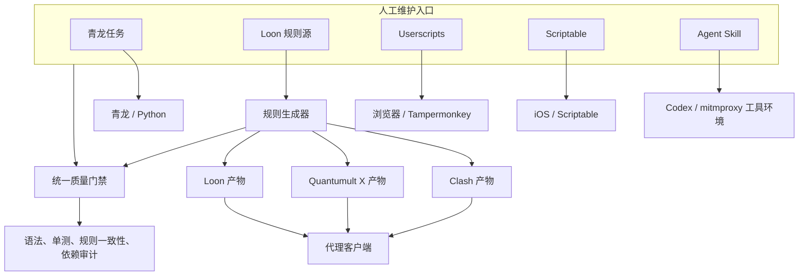
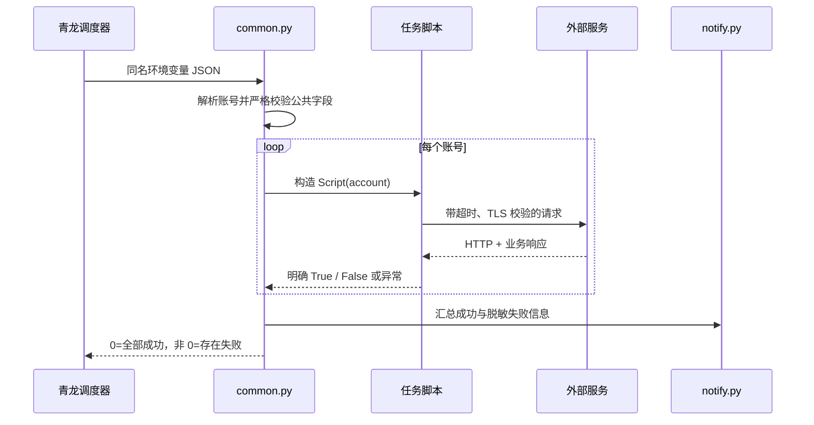

# xp-toolkit 架构

本文定义仓库在继续增长时必须保持的边界。它描述的是可执行约束，而不是目录导览的重复版。

## 一句话模型

xp-toolkit 是多个独立交付物组成的 monorepo，不是一个统一部署的应用。共享仓库、测试和发布治理，
但不同运行时之间不建立隐式运行时依赖。

## 架构原则

### 1. 按交付物划分，而不是按语言划分

顶层目录是部署边界：`qinglong/`、`proxy/`、`scriptable/`、`userscripts/`、`skills/` 和未来的
`raycast/`。一个目录内可以共享代码；跨目录默认只能共享文档、测试约定和生成协议。

这样做避免一个独立 userscript 因为“复用”仓库模块而变得无法单文件安装，也避免青龙环境被迫安装
Raycast 或浏览器工具链。

### 2. 人工源与生成物必须单向流动

代理规则的唯一人工源是：

- `proxy/loon/Self-Direct.list`
- `proxy/loon/Self-Proxy.list`

Clash 与 Quantumult X 文件是生成物。`.github/scripts/sync_rules.py` 负责转换，
`.github/scripts/check_rules.py` 负责格式、重复、语义冲突和一致性验证。禁止手工修补生成物，
因为下一次生成会覆盖它，也无法确认哪一份才是真实来源。

新增其他多端产物时，应复用同一模式：一个声明式源、确定性生成器、提交生成物、CI 中重新生成并检查
工作树无差异。

### 3. 信任边界必须显式

项目处理 cookie、API Key、WebDAV 密码、qBittorrent 删除权限和抓包响应。以下约束属于架构，
不能由每个新脚本自行决定：

- 公网凭据端点建议使用 HTTPS；对用户明确配置的 HTTP 端点保持兼容。
- URL 与密钥作为不可拆分的凭据对迁移，不能让远端配置只替换 URL。
- 密钥不进入日志、URL、剪贴板默认导出、网页可读存储或抓包明文产物。
- 核心登录/签到的网络错误、HTTP 失败和明确业务失败都算失败；余额等可选展示字段不应反过来拖垮主任务。
- 删除操作默认 dry-run；删除数据和删除文件分别授权，并要求可审计的明确确认。
- 安全检查异常时 fail closed，不以兼容性为由继续执行高风险动作。

`qinglong/common.py` 提供共享配置解析和服务根地址校验。新的 Python 任务应优先扩展小而明确的
共享原语，不能在每个脚本里复制一套宽松解析器。

### 4. 测试保存不变量，而不只保存当前输出

高价值测试关注“永远不能发生什么”：

- Direct 与 Proxy 规则不能语义重叠。
- 生成器遇到未知规则必须报错，不能静默丢弃。
- 密钥不能发往未明确配置的端点，也不能通过 URL userinfo、日志或 `localStorage` 泄露。
- 业务失败不能返回成功退出码。
- API 失败不能被解释为零条记录并触发批量删除。
- 远端 HTML 不能未经清理进入高权限 DOM。

纯静态断言适合保护元数据和危险 API 不再出现；关键解析、URL 规范化和删除决策应使用可执行单测。

## 各域边界

### 青龙任务

约束：

- `Script.run()` 只有在业务结果已确认成功时才返回 `True`。
- 所有请求必须有有限超时；重试只能用于幂等操作并设置上限。
- 账号配置可能包含秘密，禁止整体打印 `account`。
- 直接导入的第三方包必须出现在 `qinglong/requirements.txt`。
- 破坏性任务必须提供 dry-run、逐项决策日志和非零失败退出码。

### 代理规则

Loon 文件是 canonical source。同步器采用临时文件、`fsync` 和原子替换；一次提交同时修改多个来源时，
只有语义一致才允许继续。CI 在 PR 中重新生成并拒绝未提交差异；`main` 上的同步任务始终从最新源全量生成，
并使用有界重试处理推送竞争。

将来规则集增加到三组以上时，应把名称、策略和输出路径移入单一 manifest，由生成、校验、工作流路径和
文档共同读取，避免多处硬编码漂移。

### Userscripts

每个文件必须保持可独立安装。网页和网页 DOM 都是不可信输入；`@grant none` 脚本尤其没有隔离存储。

- 修改代码时递增 `@version`。
- 从页面复制内容时使用 `textContent` 或严格白名单构造 DOM。
- 不覆盖 `JSON.parse`、`fetch` 等全局原语；必须 hook 时只处理已知端点并保留原实现。
- 会话和令牌只写 userscript 管理器存储，不降级到页面 `localStorage`。
- `@match`、`@connect` 和跨域请求权限保持最小化，并在无法静态收窄时记录残余风险。

### Scriptable

Scriptable 文件同样是独立交付物。凭据放 Keychain，缓存键必须包含非明文的账号/端点作用域，避免切换账号后
复用旧数据。多个互不依赖的数据源并行请求；单源失败应被隔离并在 UI 中明确显示，不能伪装成零用量。

### Skills

Skill 是自包含工具包：`SKILL.md` 是使用契约，`scripts/` 是实现。脚本不能仅为测试而假设 mitmproxy 已安装；
导入应保持可测试，运行时再验证可选工具。抓包默认仅保存元数据，结构模式也必须脱敏，明文模式要求显式
unsafe opt-in。

## 质量门禁

`.github/workflows/quality.yml` 当前执行：

1. Python lint、格式和语法检查。
2. Python 单元测试。
3. Scriptable、userscript 与 Loon JavaScript 语法检查。
4. JavaScript 单元测试。
5. 青龙直接依赖漏洞审计。

`.github/workflows/sync-rules.yml` 单独保护规则生成链路。Dependabot 维护 Python 和 GitHub Actions
直接依赖。

尚未覆盖的门禁记录在[安全与稳定性审计](2026-08-15-security-and-architecture-audit.md)中，不能用
“当前 CI 绿色”替代对残余风险的判断。

## 扩展决策

新增功能时按以下顺序判断：

1. 它在哪里运行、如何安装、由谁持有凭据？这决定顶层目录。
2. 它是否能作为单文件交付？若是，避免跨文件运行时依赖。
3. 是否已有三个以上调用点重复同一规则？达到后再提取小型共享模块。
4. 输入、输出、失败和副作用契约是否能被测试？先定义契约再接网络。
5. 是否引入新的生成物、包管理器或秘密类型？同步扩展 CI、Dependabot、忽略规则和文档。

不要因为预计项目会变大就提前建立一个万能框架。这里优先稳定边界、确定性生成和窄接口；只有真实重复出现时
才抽象实现。
